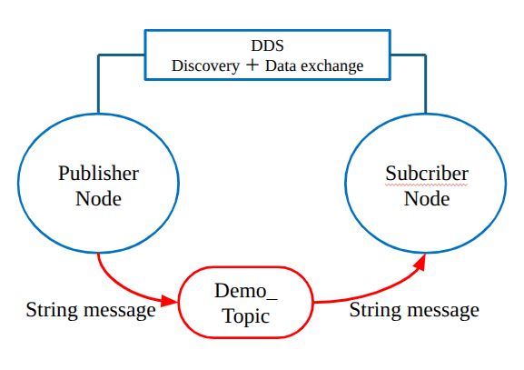
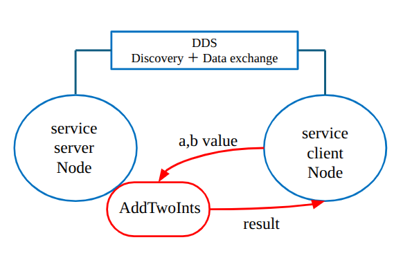
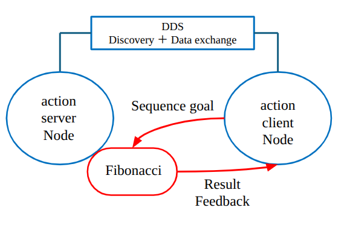
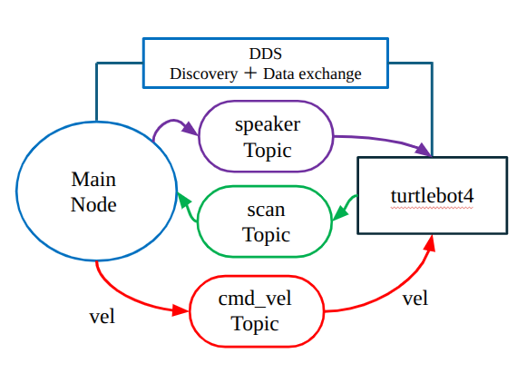
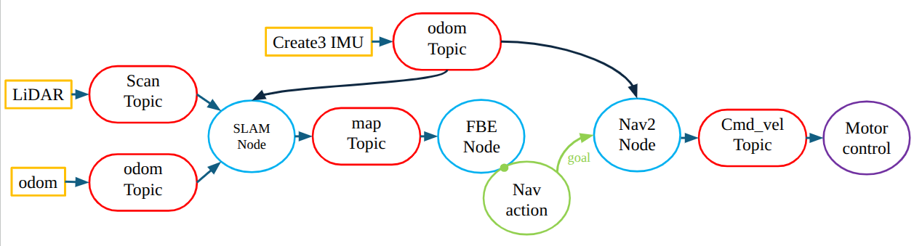
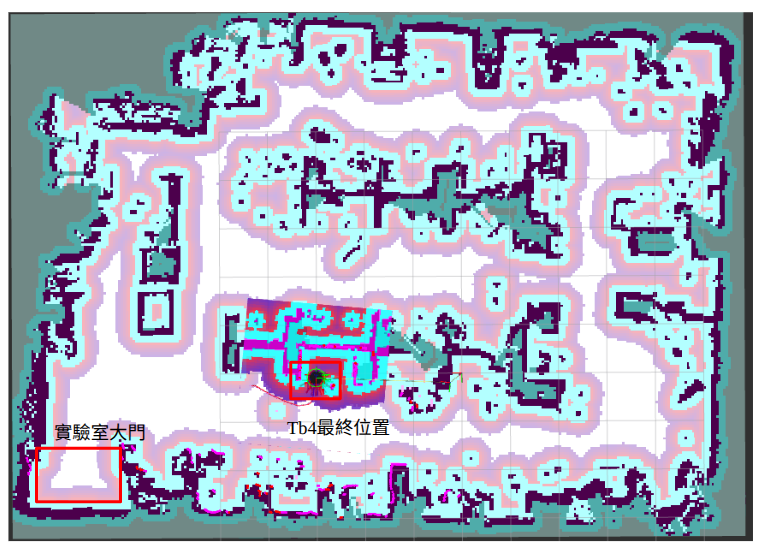

## 環境安裝

[環境安裝 markdown file](turtlebot4_env_install.md)

## 建置 ROS 2 Workspace

進入 TurtleBot 4 控制專案的 ROS 2 Workspace：

```bash
cd ros2_ws/turtlebot4_control
```


建置 Packages：

```bash
colcon build
```

載入 Workspace 環境：

```bash
source install/setup.bash
```

> 每次開啟新的終端機後，都需要重新載入 ROS 2 與 Workspace 環境。


---

## ROS 2 通訊範例

### Topic 通訊測試

開啟兩個終端機。

#### Terminal 1：啟動 Subscriber

```bash
ros2 run ros2_comm_demo topic_subscriber
```

Subscriber 會等待並接收 Publisher 發布的 Topic 訊息。

#### Terminal 2：啟動 Publisher

```bash
ros2 run ros2_comm_demo topic_publisher
```

Publisher 啟動後，應持續發布訊息。Terminal 1 的 Subscriber 應能顯示接收到的資料。

<p align="center">

</p>

---

### Service 通訊測試

Service 適合由 Client 發送一次請求，並由 Server 回傳一次結果。

開啟兩個終端機。

#### Terminal 1：啟動 Service Server

```bash
ros2 run ros2_comm_demo service_server
```

Server 啟動後會等待 Client 傳送請求。

#### Terminal 2：啟動 Service Client

```bash
ros2 run ros2_comm_demo service_client
```

Client 會向 Server 發送請求，並顯示 Server 回傳的結果。

<p align="center">

</p>

---

### Action 通訊測試

Action 適合需要較長執行時間的任務，例如導航、旋轉、抓取或執行一段機器人動作。

Action 除了回傳最終結果，也能在執行過程中提供 Feedback，並支援取消任務。

開啟兩個終端機。

#### Terminal 1：啟動 Action Server

```bash
ros2 run ros2_comm_demo action_server
```

Action Server 啟動後會等待 Client 傳送 Goal。

#### Terminal 2：啟動 Action Client

```bash
ros2 run ros2_comm_demo action_client
```

Action Client 會向 Server 傳送 Goal，並顯示：

- Goal 是否被接受。
- 執行中的 Feedback。
- 任務完成後的 Result。

<p align="center">

</p>

---

## TurtleBot 4 LiDAR 控制範例

`tb4_lidar_control` Package 使用 TurtleBot 4 的 LiDAR 資料控制機器人移動。

執行以下節點：

```bash
ros2 run tb4_lidar_control forward_stop_beep_node
```

此節點的基本執行流程為：

1. 訂閱 LiDAR 雷射掃描資料。
2. 控制 TurtleBot 4 向前移動。
3. 持續偵測機器人前方的障礙物距離。
4. 當障礙物距離低於設定的安全距離時停止移動。
5. 觸發 TurtleBot 4 蜂鳴器

<p align="center">

</p>

---

## TurtleBot 4 SLAM、導航與自主探索

`tb4_slam_nav_control` 使用以下 ROS 2 系統：

- TurtleBot 4 Bringup
- SLAM Toolbox
- Navigation2
- RViz 2
- Autonomous Frontier Exploration

<p align="center">

</p>

執行自主探索時，開啟四個終端機，並依照以下順序啟動。

### Terminal 1：啟動 SLAM Toolbox

```bash
ros2 launch turtlebot4_navigation slam.launch.py
```

SLAM Toolbox 會使用 LiDAR、Odometry 與 TF 資料建立地圖。

---

### Terminal 2：啟動 Navigation2

```bash
ros2 launch turtlebot4_navigation nav2.launch.py
```

Navigation2 負責：

- 全域路徑規劃。
- 區域路徑規劃。
- 障礙物避讓。
- 導航目標管理。
- 速度指令輸出。
- 導航失敗時的恢復行為。

---

### Terminal 3：啟動 RViz 2

```bash
ros2 launch turtlebot4_viz view_robot.launch.py
```

RViz 2 可用於查看：

- TurtleBot 4 機器人模型。
- LiDAR 雷射掃描資料。
- SLAM 建立的地圖。
- TF 座標系。
- Odometry。
- Navigation2 的全域與區域路徑。
- Autonomous Exploration 選擇的目標點。

---

### Terminal 4：啟動自主邊界探索節點

```bash
ros2 run autonomous_exploration control_tb4
```

自主探索節點會讀取目前的地圖，搜尋已知區域與未知區域之間的邊界，並將適合的 Frontier 傳送給 Navigation2 作為下一個導航目標。

基本流程：

```text
接收地圖資料
    ↓
辨識未知區域與已知區域的邊界
    ↓
產生 Frontier 候選點
    ↓
過濾不可到達或不安全的目標
    ↓
選擇下一個探索目標
    ↓
傳送 NavigateToPose Goal
    ↓
TurtleBot 4 前往目標位置
    ↓
更新地圖並重複搜尋
```
<p align="center">

</p>

<p align="center">
Slam+Rviz2 最終建圖範例
</p>
