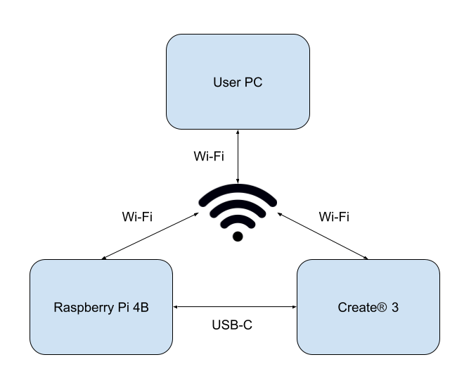
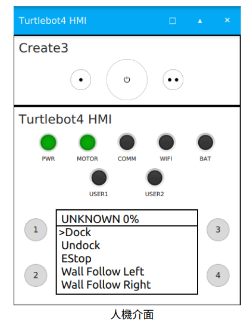

# TurtleBot 4 environment

此資料夾包含一套可重複使用的電腦端環境安裝腳本，主要用於 TurtleBot 4 的控制、地圖建立、導航，以及自主邊界探索（Autonomous Frontier Exploration）專案。

## Environment

### User PC

- Ubuntu 22.04
- ROS 2 Humble
- TurtleBot 4 desktop packages
- RViz 2
- Navigation2 / Nav2 bringup
- SLAM Toolbox
- `teleop_twist_keyboard`
- TF2
- `colcon`, `rosdep`, and `vcstool`
- Python ROS nodes using `rclpy`
- NumPy, Pandas, and Matplotlib for topic-frequency CSV analysis

### Robot

- TurtleBot 4 / Create 3
- Raspberry Pi 4B
- TurtleBot 4 bringup services
- Create 3 republisher
- RPLIDAR, odometry, IMU, battery, docking, wheel, camera, TF, and velocity topics

<p align="center">

</p>

<p align="center">
turtlebot4架構圖
</p>

## Install

```bash
cd scripts
chmod +x turtlebot_env.sh
./turtlebot_env.sh
```


## 透過 SSH 登入 TurtleBot 4 並修復 Create 3 連線

<p align="center">

</p>

當 TurtleBot 4 robot 界面的五燈未全部亮起，且無法接收 Create 3 的資料，或電腦端無法找到 `/odom`、`/imu`、`/battery_state` 等 ROS 2 Topics 時，可以透過 SSH 登入 Raspberry Pi，重新啟動 Create 3 與 TurtleBot 4 的相關服務。

### 1. SSH 登入 TurtleBot 4 的 Raspberry Pi

請先確認電腦與 TurtleBot 4 連接到相同網路，再執行：

```bash
ssh ubuntu@<TURTLEBOT_IP>
```

將 `<TURTLEBOT_IP>` 替換成 TurtleBot 4 Raspberry Pi 的實際網路 IP

預設登入資訊：

```text
Password: turtlebot4
```

### 2. 重新啟動 Create 3 與 TurtleBot 4 服務

成功登入 Raspberry Pi 後，依序執行：

```bash
sudo systemctl restart create3_repub.service
sudo systemctl restart turtlebot4.service
```

### 3. 確認服務是否正常運作

執行以下指令查看服務狀態：

```bash
systemctl status create3_repub.service
systemctl status turtlebot4.service
```

正常情況下，兩個服務都應顯示：

```text
active (running)
```

### 4. 回到電腦端確認 ROS 2 連線

在電腦端開啟新的終端機，確認是否能找到 TurtleBot 4 的 Topics：

```bash
ros2 topic list
```
